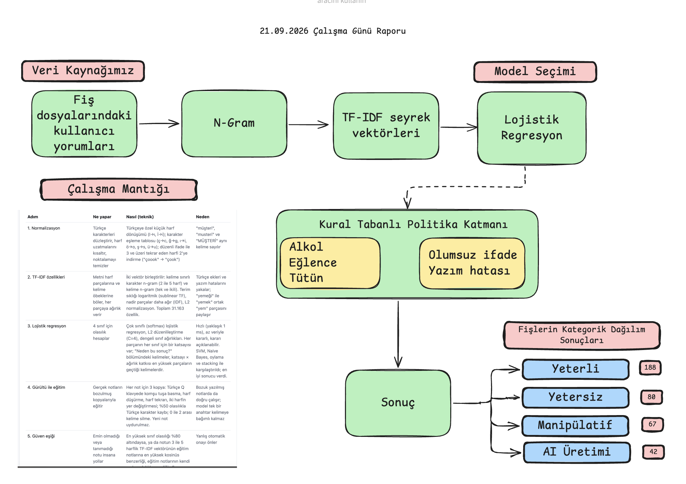
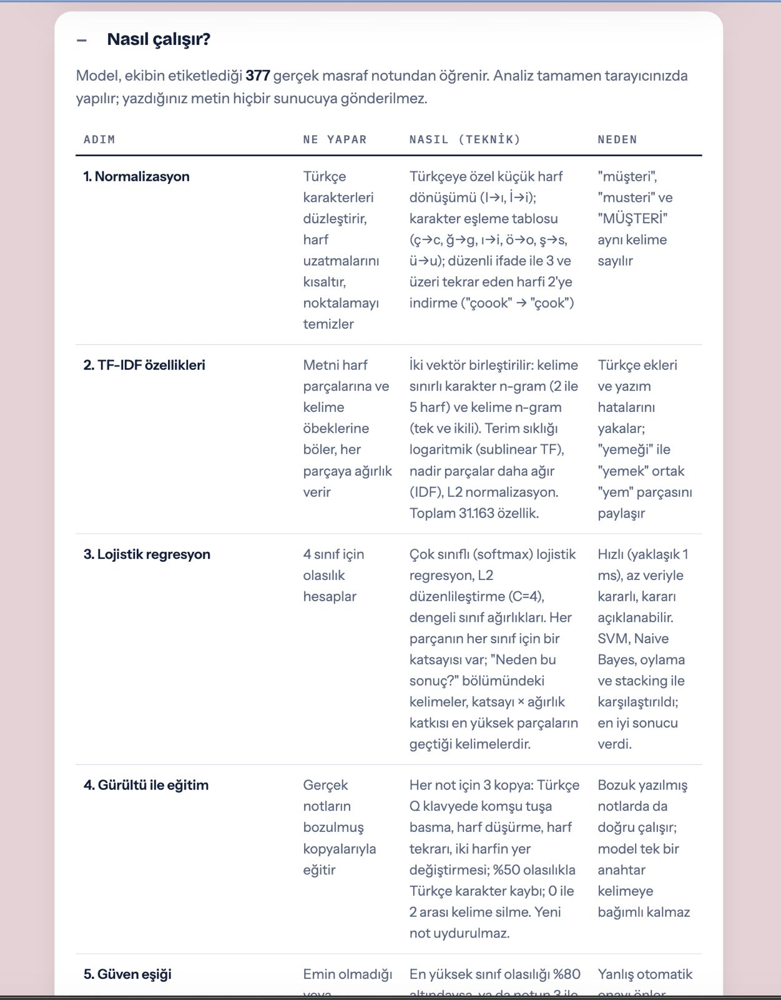
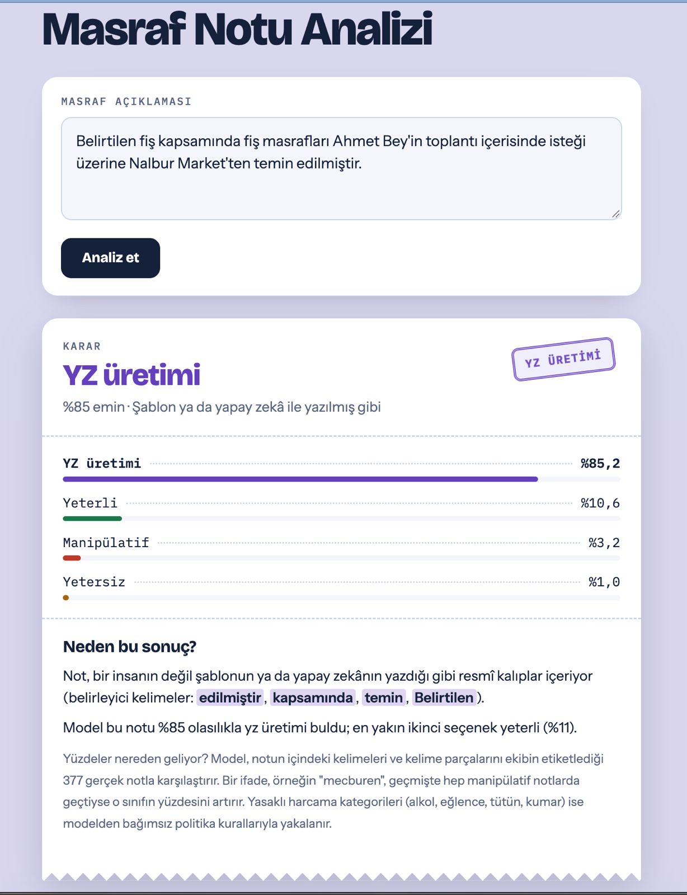
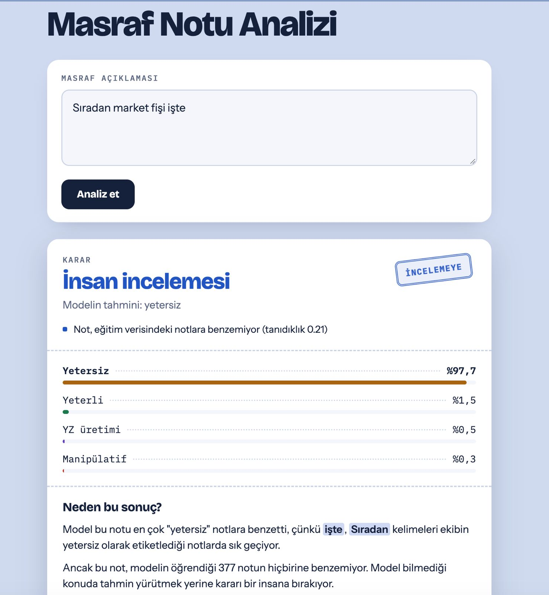
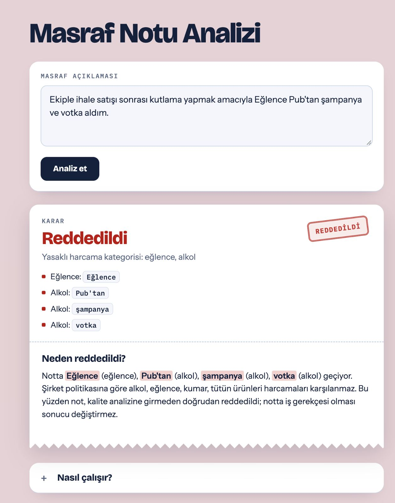

# Masraf Analizi: NLP Tabanlı Fiş ve Yorum Sınıflandırma Sistemi

Bu proje, fiş dosyalarından elde edilen kullanıcı yorumlarını Doğal Dil İşleme ve Makine Öğrenmesi teknikleri kullanarak analiz eden, sınıflandıran ve şirket politikalarına uygunluğunu denetleyen akıllı bir sistemdir.

Site: https://masraf-nlp.vercel.app/

## Proje Hakkında

Sistem, masraf beyanlarındaki açıklamaları analiz ederek masrafın geçerli olup olmadığını tespit eder. Yalnızca makine öğrenmesi sınıflandırması yapmakla kalmaz, aynı zamanda gelişmiş bir kural tabanlı katman sayesinde bağlamı (olumsuzluk ekleri, yazım hataları vb.) anlayarak yüksek doğrulukta kararlar verir.

## Veri Seti ve Sınıf Dağılımı

Modelin eğitildiği veri setindeki kategorik sınıf dağılımı aşağıdaki gibidir:

* Yeterli: 188
* Yetersiz: 80
* Manipülatif: 67
* AI: 42

## Sistem Mimarisi ve Çalışma Mantığı

Proje iki ana katmandan oluşmaktadır: Makine Öğrenmesi Modeli ve Gelişmiş Kural Tabanlı Politika Motoru.

### 1. Metin İşleme ve Modelleme
* N-gram ve TF-IDF: Kullanıcı yorumları öncelikle n-gram yöntemiyle anlamlı parçalara ayrılmıştır. Elde edilen bu gruplar, metin madenciliğinde sıkça kullanılan TF-IDF (Term Frequency-Inverse Document Frequency) yöntemiyle seyrek vektörlere (sparse vectors) dönüştürülmüştür.
* Lojistik Regresyon: Metinlerden elde edilen sayısal vektörler kullanılarak bir Lojistik Regresyon modeli eğitilmiştir.
* Çapraz Doğrulama (Cross-Validation): Veri setinin dengesini ve modelin genellenebilirliğini korumak amacıyla StratifiedGroupKFold yöntemi kullanılmıştır. Veri seti 1 parça test ve 4 parça eğitim olacak şekilde ayrılmıştır.

### 2. Kural Tabanlı Politika ve İstisna Yönetimi
* Yasaklı İş Kolları Entegrasyonu: JSON formatındaki dosyalardan çekilen alkol, eğlence, tütün gibi yasaklı iş kollarına ait etiketler ve açıklamalar birleştirilerek sisteme entegre edilmiştir.
* Bağlam ve Yazım Hatası Analizi: Kural tabanlı katman, sadece basit kelime eşleştirmesi yapmaz. Cümle içerisinde yasaklı kollarla ilgili kelimeler geçse bile, cümlenin genelinde olumsuz bir ifade varsa (örneğin ürünün alınmadığının belirtilmesi) veya kelimelerde yazım hatası yapılmışsa bu durumları ayırt edebilir.
* Hibrit Skorlama: Lojistik regresyon tahminleri ve TF-IDF skorlaması, kural mantığı ile harmanlanarak temel karar mekanizmasını oluşturur.

## Ekran Görüntüleri

Aşağıdaki tablo üzerinden sistemin nasıl çalıştığını ve farklı senaryolara verdiği tepkileri inceleyebilirsiniz:

| | |
|:---:|:---:|
|    **Sistemin Çalışma Mantığı** |    **Yapay Zeka Üretimi Metin Tespiti** |
|    **Yetersiz Açıklama Durumu** |    **Politikaya Aykırı - Reddedildi** |
